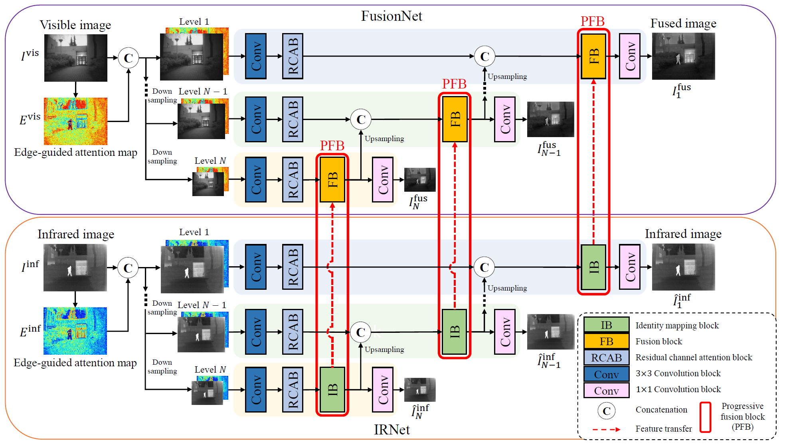

# MPFusion

### Seonghyun Park and Chul Lee
Official pytorch implementation for **"Multiscale Progressive Fusion of Infrared and Visible Images"**

<p float="left">
  &emsp;&emsp; 
</p>

## Preparation
### Testing samples: [Download from GoogleDrive](https://drive.google.com/drive/folders/1OPXJ3LjO7h49OoYZ7I0neuxYLjGO8A_-)
The ZIP file contains three test datasets:
- KAIST dataset: 200 image pairs
- TNO dataset: 20 image pairs
- RoadScene dataset: 221 image pairs

### Pretrained weights: [Download from GoogleDrive](https://drive.google.com/file/d/1GSi2N0lBmane_wBAalyqbmUQmeXcA7D2/view?usp=share_link)
The ZIP file contains two pretrained weights:
- IR_Net_model.pth: pretrained weight of IRNet
- Fusion_Net_model.pth: pretrained weight of FusionNet

## Citation
If you find this work useful for your research, please consider citing our paper:
```
@article{Park2022,
    author={Park, Seonghyun and Lee, Chul},
    booktitle={IEEE Access},
    title={Multiscale Progressive Fusion of Infrared and Visible Images}, 
    year={2022},
    volume={10},
    number={},
    pages={126117-126132},
    doi={10.1109/ACCESS.2022.3226564}}
}
```

## License
See [MIT License](https://github.com/seonghyun0108/MPFusion/blob/main/LICENSE)
